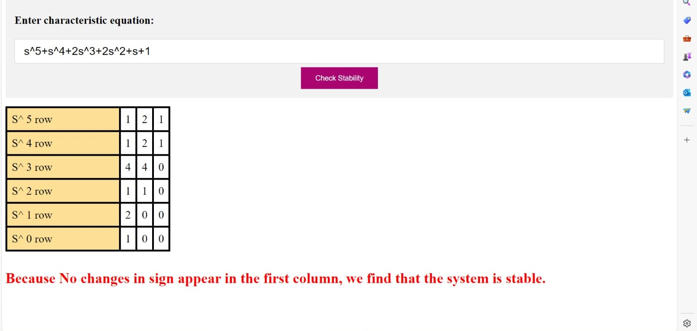
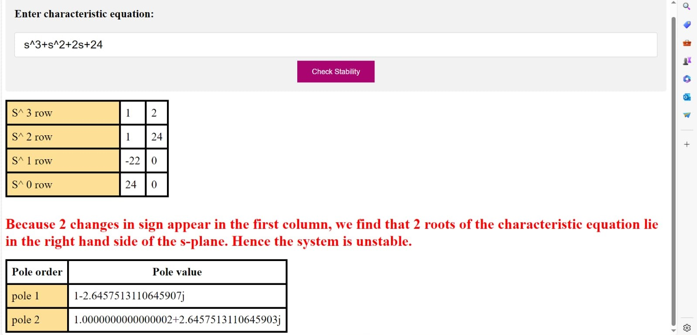

# Signal Flow Graph & Routh Hurwitz Criterion Web Application

## Description
Web-Based Signal Flow Graph Representation of Systems & Routh Stability Application for Control Systems. 
2nd Year, Computer and Systems Engineering, Alexandria University.

## User Interface
### Signal Flow Graph

#### Input

#### Output

### Routh Hurwitz

##### For more information: [Report](https://github.com/AhmedIAshraf/Control-Systems-Signal-Flow-Routh-/blob/main/assets/Control%20Programming%20Assignment.pdf)

