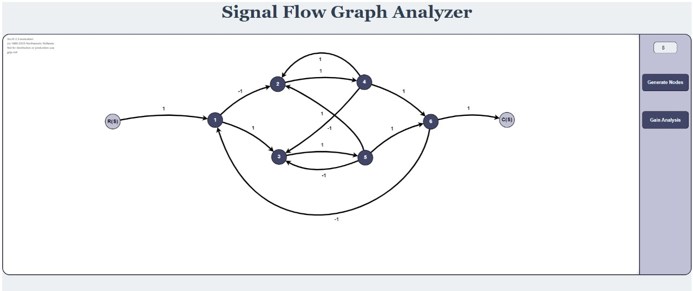
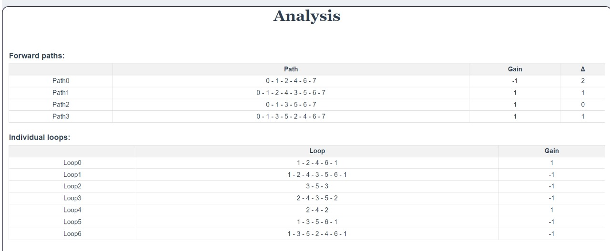
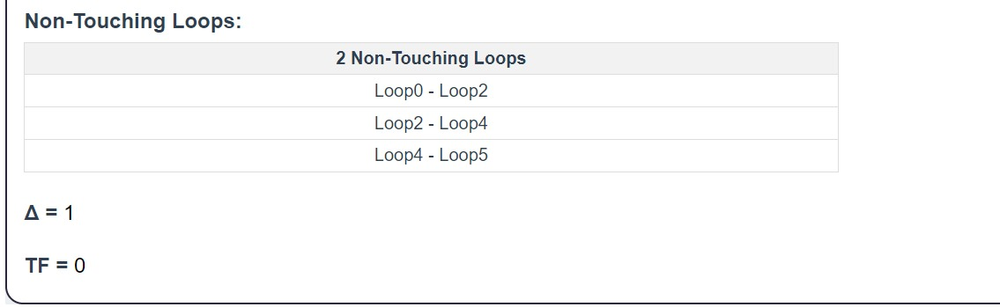

# Signal Flow Graph & Routh Hurwitz Criterion Web Application

### Description
Web-Based Signal Flow Graph Representation of Systems & Routh Stability Application for Control Systems. 
2nd Year, Computer and Systems Engineering, Alexandria University.

### User Interface
#### Input

#### Output

##### For more information: [Report](https://docs.google.com/document/d/1uL6hMLFGFQyZ6YEJPBvKRHZYymve6Q4Pme5JzqsNWIE/edit?usp=sharing)